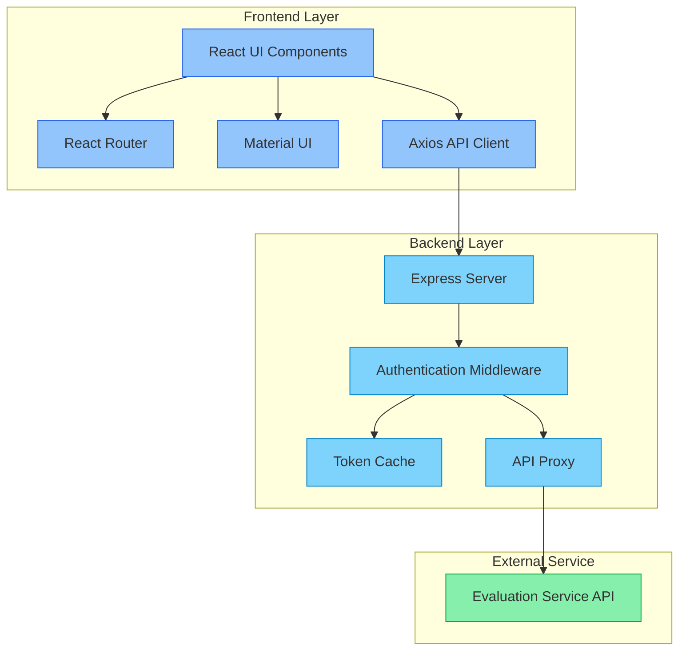

# 2K22CSUN01038
# Social Media Analytics Dashboard

A full-stack application that provides analytics for social media data, displaying top users, trending posts, and a real-time feed of the latest content.

## Project Overview

This project consists of two main components:

1. **Backend API Server** (question1): A Node.js Express server that interfaces with an external evaluation service API, handling authentication and data processing.

2. **Frontend Dashboard** (question2): A React application that displays social media analytics in an intuitive user interface.

## Architecture

## Authentication Flow
1. The backend server authenticates with the evaluation service using client credentials
2. The server caches the authentication token and handles token expiration
3. All API requests to the evaluation service include the token via an authentication middleware
4. The frontend communicates with the backend server, which proxies authenticated requests to the evaluation service
## Backend API Endpoints
Endpoint Method Description /api/users GET Get all users /api/users/:userId/posts GET Get posts by user ID /api/posts/:postId/comments GET Get comments for a post /api/top-users GET Get top users with most commented posts /api/posts?type=popular GET Get popular posts (most comments) /api/posts?type=latest GET Get latest posts

# RESPONSE I GOT ON MY FRONTEND after INTEGRATION

## Frontend Features
- Top Users Page : Displays users with the most commented posts
- Trending Posts Page : Shows posts with the highest number of comments
- Latest Feed Page : Real-time feed of the most recent posts with auto-refresh
- Responsive Design : Works on both desktop and mobile devices
- Material UI Components : Modern and clean user interface
## Data Flow
1. The frontend makes API calls to the backend server
2. The backend authenticates with the evaluation service
3. The backend aggregates and processes data from multiple API calls
4. Processed data is returned to the frontend for display
5. The frontend updates the UI with the received data

## Setup Instructions
### Backend Server (question1)
bash

cd question1
npm install
npm start

The server will run on http://localhost:3001

### Frontend Application (question2)
bash

cd question2
npm install
npm start

The application will run on http://localhost:3000

## Environment Variables
No environment variables are required as configuration is hardcoded in the application. In a production environment, sensitive information should be moved to environment variables.

## Project Structure
### Backend (question1)
- server.js - Main server file with API endpoints and authentication logic
- package.json - Project dependencies and scripts
### Frontend (question2)
- src/App.js - Main application component with routing
- src/pages/ - Page components (TopUsers, TrendingPosts, Feed)
- src/services/api.js - API client for communicating with the backend
- public/ - Static assets
## Development
### Available Scripts Backend
- npm start - Start the server Frontend
- npm start - Start the development server
- npm test - Run tests
- npm run build - Build for production
- npm run eject - Eject from Create React App
## Dependencies
### Backend
- Express - Web server framework
- Axios - HTTP client
- CORS - Cross-Origin Resource Sharing middleware
### Frontend
- React - UI library
- React Router - Navigation
- Material UI - Component library
- Axios - HTTP client
